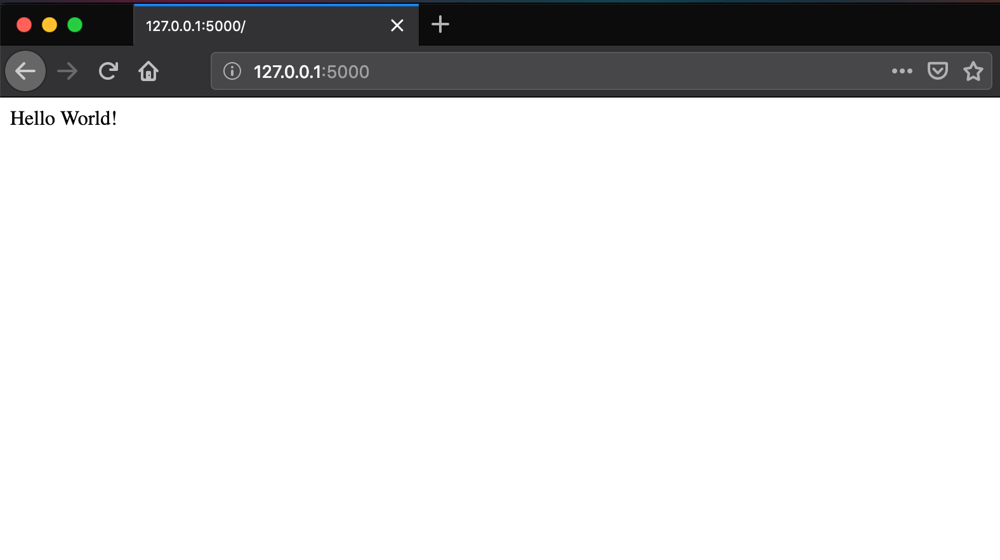

# Lesson 1 - Introduction to Flask - Hello World with variable

## Learning Objectives
* Create a basic Flask application

## The Walkthrough
1. Create a Flask Application
	* Name it FlaskApp_01

2. Edit the main python file (FlaskApp_01.py)
	* Make it look like the following

```python
from flask import Flask

app = Flask(__name__)

@app.route('/')
def hello_world():
    name = "Jon Snow"
    return "Hello world! My name is " + name

if __name__ == '__main__':
    app.run()
```
If it is done properly, when you run your application, you will be able to navigate to localhost:5000 and see this:


## What is Going On
