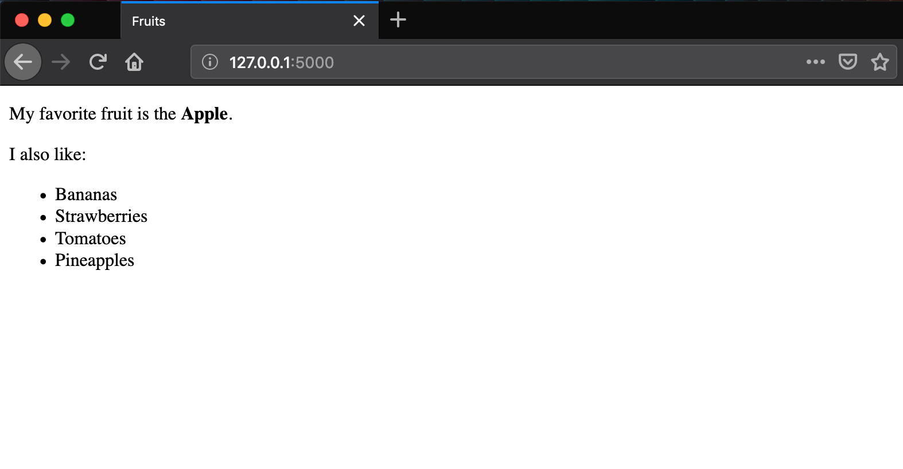

# Lesson 2 - Hello world with template

## Learning Objectives
* Learn how to use html templates with Flask

## The Walkthrough
1. Create a Flask Application
	* Name it FlaskApp_01

2. Edit the main python file (FlaskApp_02.py)
	* Make it look like the following

```python
from flask import Flask, render_template

app = Flask(__name__)

@app.route('/')
def start():
    favorite_fruit = "Apple"
    other_fruits = ["Bananas", "Strawberries", "Tomatoes", "Pineapples"]
    return render_template("index.html",
                           favorite_fruit = favorite_fruit,
                           other_fruits = other_fruits)

if __name__ == '__main__':
    app.run()
```

3. Create a Template
	* Right click on templates and click New -> Html
	* Name it index.html
	* Edit it to look like this:

```html
<!DOCTYPE html>
<html lang="en">
<head>
    <meta charset="UTF-8">
    <title>Fruits</title>
</head>
<body>
  <p>My favorite fruit is the <b>{{ favorite_fruit }}</b>.</p>
    I also like:
    <ul>
        
            <li>{{ fruit }} </li>
        
    </ul>
</body>
</html>
```

If it is done properly, when you run your application, you will be able to navigate to http://localhost:5000 and see this:


## What is Going On

Flask uses Jinja2 to parse templates and render variables. 

In the start function of FlaskApp_02.py, we are passing data to the template using the render_template method to be rendered by Jinja. ThiJinjas method requires the name of your html template as its first argument, and the data your would like to display in subsequent arguments. Data of any type can be passed from your function to the view (strings, lists, dictionaries, etc.) Here, we are passing in a string and a list.

Jinja looks for your template in the templates folder by default. By convention, we can also include stylesheets and javascript files in the static folder. These will be explored in a later lesson.

The ```{{ }}``` syntax in our index template tells Jinja that we are going to include an invidual variable. Jinja will render the variable given into the template as is. In other words, you are using this variable expression to tell the template that text should be displayed within the paragraph tag, and that the text should be the value of the object called favorite_character.

If, instead, we want to incluse logic inside the template (e.g. to do something more complex), we use the `````` syntax. In this case, we are looping through a list of strings and rendering each string in that list. 


 


