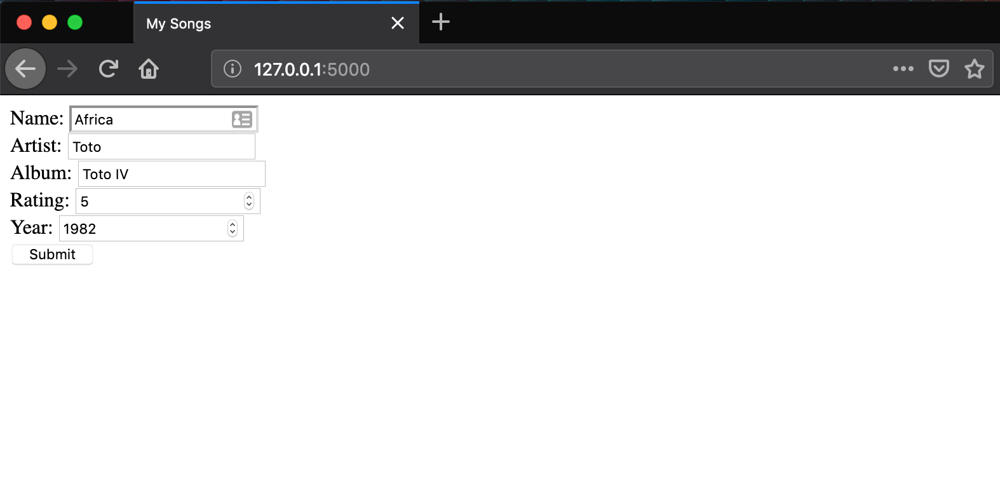
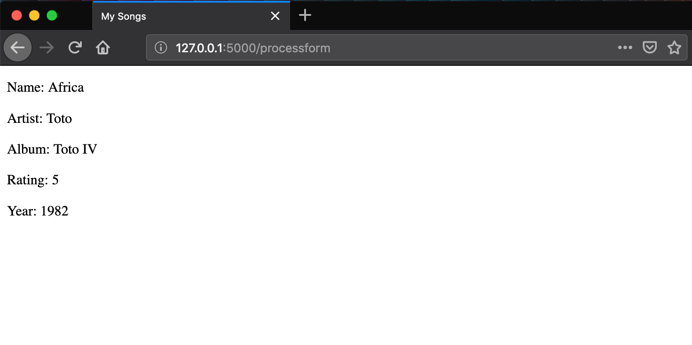

# Lesson 4 - Handling Form Values (Advanced)

## Learning Objectives
* Capturing form values in the controller
* Using the Flask request method
* Creating a GET/POST route

## The Walkthrough
1. Create a Flask Application
	* Name it FlaskApp_04

2. Edit the main python file (FlaskApp_04.py)
	* Make it look like the following

```python
from flask import Flask, render_template, request, redirect, url_for

app = Flask(__name__)

@app.route('/')
def login():
    return render_template("form.html")

@app.route('/processform', methods=['GET', 'POST'])
def processform():
    song = request.form
    return render_template("index.html", song=song)

if __name__ == '__main__':
    app.run()
```

3. Create an index page
	* In the template folder, create an index.html file
	* Make it look like the following

```html

<!DOCTYPE html>
<html lang="en">
<head>
    <meta charset="UTF-8">
    <title>Title</title>
</head>
<body>
    <p>Name: {{ song.name }} </p>
    <p>Artist: {{ song.artist }} </p>
    <p>Album: {{ song.album }} </p>
    <p>Rating: {{ song.rating }} </p>
    <p>Year: {{ song.year }} </p>
</body>
</html>
```

3. Create a form page
	* In the template folder, create an form.html file
	* Make it look like the following

```html
<!DOCTYPE html>
<html lang="en">
<head>
    <meta charset="UTF-8">
    <title>Title</title>
</head>
<body>
    <form action="{{ url_for('processform') }}" method="POST" >
        Name: <input type="text" name="name" /><br />
        Artist: <input type="text" name="artist" /><br />
        Album: <input type="text" name="album" /><br />
        Rating: <input type="number" name="rating" /><br />
        Year: <input type="number" name="year" /><br />
        <input type="submit" value="Submit" >
    </form>
</body>
</html
```

If it is done properly, when you run your application, you will be able to navigate to localhost:5000 and see this:



## What is Going On