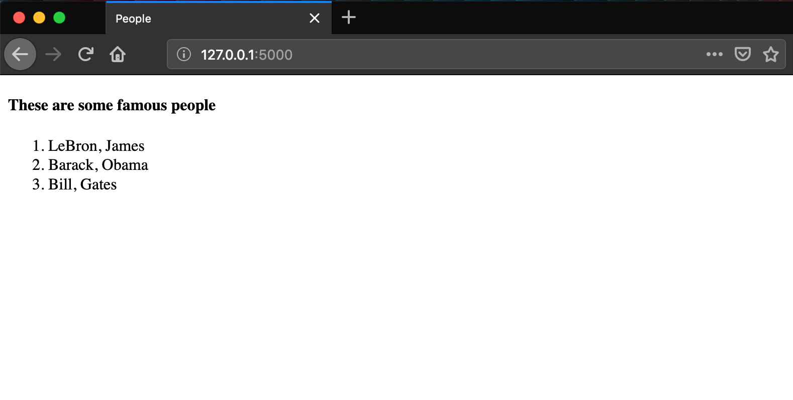

# Lesson 5 - Connecting to a database 

## Learning Objectives
* Connect to a sqlite database
* Create an object model using SQLalchemy

## The Walkthrough
1. Create a Flask Application
	* Name it FlaskApp_05

2. In your menu, go to Preferences -> Project Interpreter -> Click the plus button in the lower left corner. Search for Flask-SQLAlchemy and click "Install Package".

2. Edit the main python file (FlaskApp_05.py)
	* Make it look like the following

```python
from flask import Flask, render_template
from flask_sqlalchemy import SQLAlchemy

app = Flask(__name__)
app.config['SQLALCHEMY_DATABASE_URI'] = 'sqlite:///flaskr.db'
db = SQLAlchemy(app)


@app.route('/')
def start():

    db.session.add(Person("LeBron", "James"))
    db.session.add(Person("Barack", "Obama"))
    db.session.add(Person("Bill", "Gates"))

    db.session.commit()

    people = Person.query.all()

    return render_template("index.html", people = people)


class Person(db.Model):
    id = db.Column(db.Integer, primary_key=True)
    firstname = db.Column(db.String(50))
    lastname = db.Column(db.String(50))

    def __init__(self, firstname, lastname):
        self.firstname = firstname
        self.lastname = lastname

if __name__ == '__main__':
    db.create_all()
    app.run()
```

3. Create an index page
	* In the template folder, create an index.html file
	* Make it look like the following

```html
<!DOCTYPE html>
<html lang="en">
<head>
    <meta charset="UTF-8">
    <title>People</title>
</head>
<body>
    <h4>These are some famous people</h4>
    <ol>
    
        <li>{{ person.firstname}}, {{ person.lastname}}</li>
    
    </ol>
</body>
</html>
```

If it is done properly, when you run your application, you will be able to navigate to localhost:5000 and see this:



## What is Going On

In this example, we are going to use SQLalchemy to store data into a local database. SQLalchemy is a python toolkit and Object Relational Mapper (ORM) that allows us to manage relational databases with the flexibility of SQL without writing any SQL code.

In FlaskApp_05.py, we first define the path of our local database file. In this case, we will place it in the current folder and name it "flaskr.db". Next we define an instance of SQLalchemy class db, which we will use to perform database operations.  

Underneath the index function, we will define a class ```Person``` which will model the Person table in our database. This will allow us to work with database rows as python objects. Here we set the contraints of the columns of the person table, and define "id" as the primary key. The ```__init__``` function allows us to define how the class ```Person``` can be instantiated in the controller. 

In the index function, we will create a series of Person objects and add them to the database. After which, we will query the database for all our people and render them in the view. In theory, we could render the objects directly in in our template without committing them to the database. However, commiting them makes the data persistence, meaning they will remain visible even after we restart the application.


