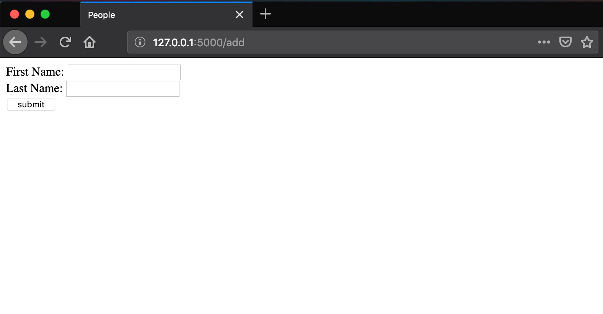
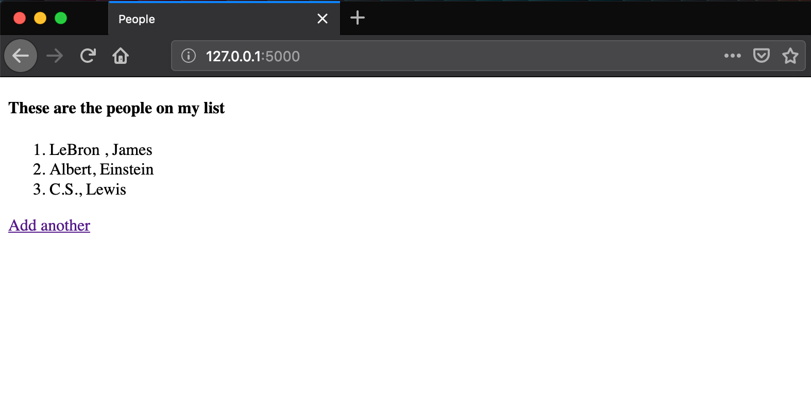

# Lesson 6 - Creating a database object in the view

## Learning Objectives
* Connect to a sqlite database
* Create an object model using SQLalchemy
* Populate the database using a form in the view

## The Walkthrough
1. Create a Flask Application
	* Name it FlaskApp_06

2. Edit the main python file (FlaskApp_06.py)
	* Make it look like the following

```python
from flask import Flask, render_template, request, redirect, url_for
from flask_sqlalchemy import SQLAlchemy

app = Flask(__name__)
app.config['SQLALCHEMY_DATABASE_URI'] = 'sqlite:///flaskr.db'
db = SQLAlchemy(app)

@app.route('/')
def index():
    people = Person.query.all()
    return render_template("index.html", people = people)

@app.route('/add')
def add():
    return render_template("form.html")

@app.route('/processform', methods=['GET','POST'])
def processform():
    firstname = request.form['first']
    lastname = request.form['last']
    person = Person(firstname,lastname)
    db.session.add(person)
    db.session.commit()
    return redirect(url_for('index'))

class Person(db.Model):
    id = db.Column(db.Integer, primary_key=True)
    firstname = db.Column(db.String(50))
    lastname = db.Column(db.String(50))

    def __init__(self, firstname, lastname):
        self.firstname = firstname
        self.lastname = lastname

if __name__ == '__main__':
    app.run()
```

3. Create an index page
	* In the template folder, create an index.html file
	* Make it look like the following

```html
<!DOCTYPE html>
<html lang="en">
<head>
    <meta charset="UTF-8">
    <title>Title</title>
</head>
<body>
    <h4>These are the coolest people</h4>
    <ol>
    
        <li>{{ person.firstname}}, {{ person.lastname}}</li>
    
    </ol>
</body>
</html>
```

3. Create a form page
	* In the template folder, create an form.html file
	* Make it look like the following

```html
<!DOCTYPEhtml>
<htmllang="en">
<head>
    <metacharset="UTF-8">
    <title>Title</title>
</head>
<body>
    <form action="/processform" method="POST">
        FirstName: <input type="text" name="first"><br>
        LastName: <input type="text" name="last"><br>
        <input type="submit" value="submit">
    </form>
</body>
```

If it is done properly, when you run your application, you will be able to navigate to localhost:5000/add and see this:



If you navigate to localhost:5000, you will see all the names you have added.



## What is Going On