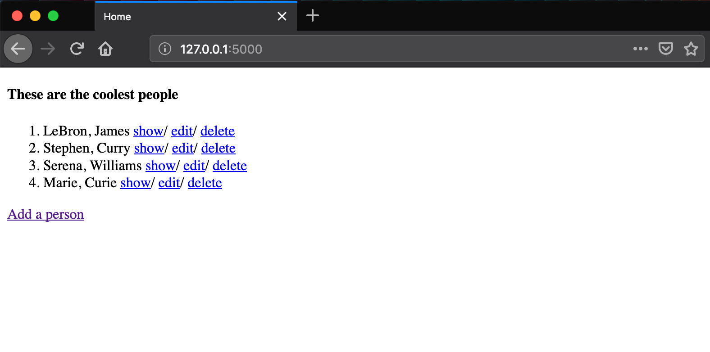
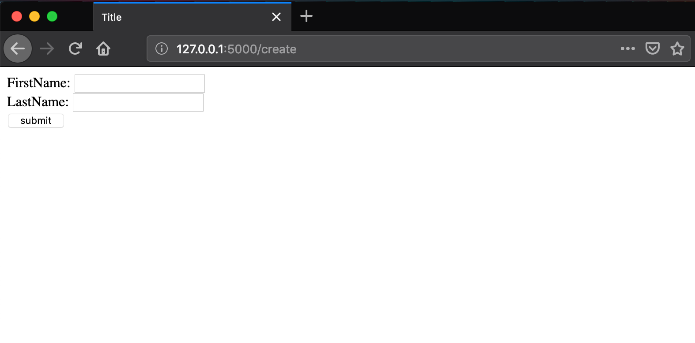

# Lesson 7 - Completing the CRUD cycle

## Learning Objectives
* Connect to a sqlite database
* Create an object model using SQLalchemy
* Create, read, update and delete objects from the view

## The Walkthrough
1. Create a Flask Application
	* Name it FlaskApp_07

2. Edit the main python file (FlaskApp_07.py)
	* Make it look like the following

```python
from flask import Flask, render_template, request, redirect, url_for
from flask_sqlalchemy import SQLAlchemy

app = Flask(__name__)
app.config['SQLALCHEMY_DATABASE_URI'] = 'sqlite:///flaskr.db'
db = SQLAlchemy(app)


@app.route('/')
def index():
    people = Person.query.all()
    return render_template("index.html", people = people)


@app.route('/add')
def add():
    return render_template("form.html")


@app.route('/show/<int:id>')
def show(id):
    person = Person.query.get(id)
    return render_template("show.html", person = person)


@app.route('/edit/<int:id>')
def edit(id):
    person = Person.query.get(id)
    return render_template("form.html", person = person)


@app.route('/delete/<int:id>')
def delete(id):
    person = Person.query.get(id)
    db.session.delete(person)
    db.session.commit()
    return redirect(url_for('index'))


@app.route('/processform', methods=['GET','POST'])
def processform():
    try:
        id = request.form['id']
    except:
        id = None

    firstname = request.form['first']
    lastname = request.form['last']

    if id:
        person = Person.query.get(id)
        person.firstname = firstname
        person.lastname = lastname
    else:
        person = Person(firstname,lastname)
        db.session.add(person)

    db.session.commit()
    return redirect(url_for('index'))


class Person(db.Model):
    id = db.Column(db.Integer, primary_key=True)
    firstname = db.Column(db.String(50))
    lastname = db.Column(db.String(50))

    def __init__(self, firstname, lastname):
        self.firstname = firstname
        self.lastname = lastname


if __name__ == '__main__':
    app.run()

```

3. Create an index page
	* In the template folder, create an index.html file
	* Make it look like the following

```html
<!DOCTYPE html>
<html lang="en">
<head>
    <meta charset="UTF-8">
    <title>Index</title>
</head>
<body>
    <h4>These are the coolest people</h4>
    <ol>
    
        <li>{{ person.firstname}}, {{ person.lastname}}
            <a href="show/{{ person.id }}">show</a>/
            <a href="edit/{{ person.id }}">edit</a>/
            <a href="delete/{{ person.id }}">delete</a>
        </li>
    
    </ol>

    <a href="/add">Add a person</a>
</body>
</html>
```

3. Create a form page
	* In the template folder, create an form.html file
	* Make it look like the following

```html
<!DOCTYPEhtml>
<htmllang="en">
<head>
    <metacharset="UTF-8">
    <title>Form</title>
</head>
<body>
    
        <form action="/processform" method="POST">
            <input type="hidden" value="{{ person.id }}" name="id">
            FirstName: <input type="text" name="first" value="{{ person.firstname }}"><br>
            LastName: <input type="text" name="last" value="{{ person.lastname }}"><br>
            <input type="submit" value="submit">
        </form>
    
        <form action="/processform" method="POST">
            FirstName: <input type="text" name="first" ><br>
            LastName: <input type="text" name="last" ><br>
            <input type="submit" value="submit">
        </form>
    
</body>
```
4. Create a show page
	* In the template folder, create an show.html file
	* Make it look like the following
	
```html
<!DOCTYPE html>
<html lang="en">
<head>
    <meta charset="UTF-8">
    <title>Show page</title>
</head>
<body>
    <h3>{{ person.firstname }}, {{ person.lastname }}</h3>
    <a href="/">Go back</a>
</body>
</html>
```
If it is done properly, when you run your application, you will be able to navigate to localhost:5000/add and see this:



If you navigate to localhost:5000, you will see all the people you have added. You should also be able to view, edit, or remove each of them.



## What is Going On