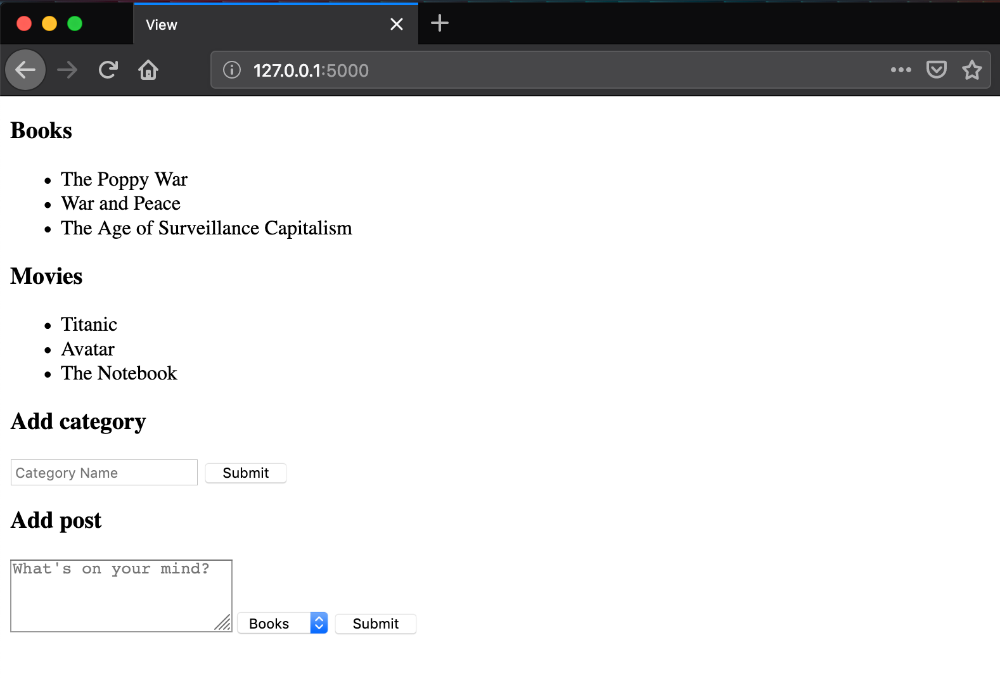

# Lesson 9 - Using Database Relationships with Flask/SQLalchemy - OneToMany

## Learning Objectives
* Create one to many relationships using SQLalchemy

## The Walkthrough
1. Create a Flask Application
	* Name it FlaskApp_09

2. Edit the main python file (FlaskApp_09.py)
	* Make it look like the following
    
```python
from flask import Flask, render_template, request, redirect, url_for
from flask_sqlalchemy import SQLAlchemy

app = Flask(__name__)
app.config['SQLALCHEMY_DATABASE_URI'] = 'sqlite:///flaskr.db'
db = SQLAlchemy(app)


@app.route('/')
def index():
    categories = Category.query.all()
    return render_template("index.html", categories=categories)

class Post(db.Model):
    id = db.Column(db.Integer, primary_key=True)
    content = db.Column(db.String(140))

    category_id = db.Column(db.Integer, db.ForeignKey('category.id'))
    category = db.relationship('Category', backref=db.backref('posts', lazy='dynamic'))

    def __init__(self, content, category):
        self.content = content
        self.category = category

    def __repr__(self):
        return '<Post %r>' % self.content


class Category(db.Model):
    id = db.Column(db.Integer, primary_key=True)
    name = db.Column(db.String(50))

    def __init__(self, name):
        self.name = name

    def __repr__(self):
        return '<Category %r>' % self.name


@app.route('/addpost', methods=['POST', 'GET'])
def add():
    content = request.form['content']
    category = db.session.query(Category).get(request.form['category'])
    post = Post(content, category)
    db.session.add(post)
    db.session.commit()
    return redirect(url_for('index'))

@app.route('/addcategory', methods=['POST'])
def add_category():
    name = request.form['category']
    category = Category(name)
    db.session.add(category)
    db.session.commit()
    return redirect(url_for('index'))

if __name__ == '__main__':
    db.create_all()
    app.run()
```

3. Create an index page
	* In the template folder, create an index.html file
	* Make it look like the following

```html
<!DOCTYPE html>
<html lang="en">
<head>
    <meta charset="UTF-8">
    <title>Title</title>
</head>
<body>

    
        <h3>{{ category.name }}</h3>
        <ul>
            
                <li>{{ post.content }} - {{ post.category.name }}</li>
            
        </ul>
    


    <h3>Add category</h3>
    <form method="POST" action="/addcategory" >
        <input type="text" name="category" placeholder="Category Name" required="true">
        <input type="submit" value="Submit">
    </form>


    <h3>Add post</h3>
    <form method="POST" action="/addpost" >
        <textarea rows="3"  placeholder="What's on your mind?" name="content"></textarea>

        <select name="category">
        
          <option value="{{ category.id }}">{{ category.name }}</option>
        
        </select>
        <input type="submit" value="Submit">
    </form>

</body>
</html>
```

If it is done properly, when you run your application, you will be able to navigate to localhost:5000 and see this:




## What is Going On