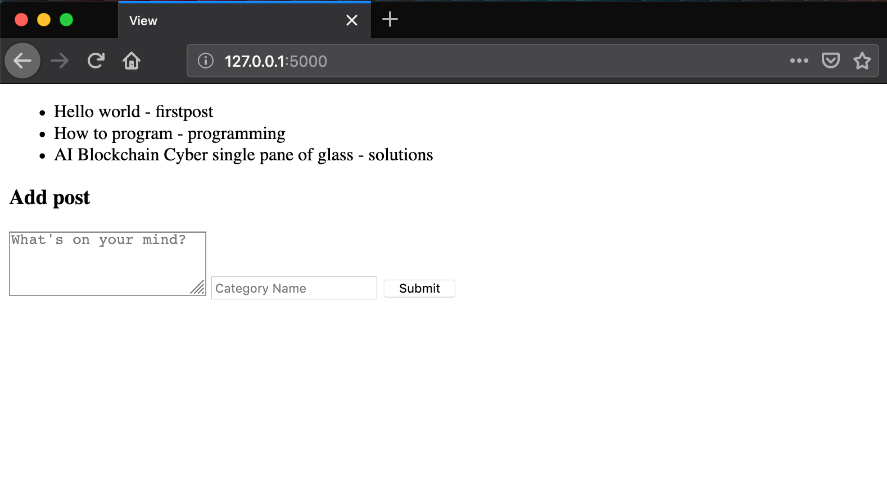

# Lesson 10 - Using Database Relationships with Flask/SQLalchemy - One to One

## Learning Objectives
* Create one to one relationships using SQLalchemy

## The Walkthrough
1. Create a Flask Application
	* Name it FlaskApp_09

2. Rename the main python file from FlaskApp_10.py to app.py
	* Make it look like the following
    
```python
from flask import Flask
from flask_sqlalchemy import SQLAlchemy

application = Flask(__name__)
application.config['SQLALCHEMY_DATABASE_URI'] = 'sqlite:///flaskr.db'
db = SQLAlchemy(application)

from routes import app
application.register_blueprint(app)


if __name__=='__main__':
    from app import db
    db.create_all()
    application.run(debug=True)

```

2. Create a file called models.py
	* Make it look like the following

```python
from app import db
import sqlalchemy.orm

class Post(db.Model):
    id = db.Column(db.Integer, primary_key=True)
    content = db.Column(db.String(140))

    category_id = db.Column(db.Integer, db.ForeignKey('category.id'))
    category = sqlalchemy.orm.relationship("Category", back_populates="post")

    def __init__(self, content, category):
        self.content = content
        self.category = category

    def __repr__(self):
        return '<Post %r>' % self.content


class Category(db.Model):
    id = db.Column(db.Integer, primary_key=True)
    name = db.Column(db.String(50))
    post = sqlalchemy.orm.relationship("Post", uselist=False, back_populates="category")

    def __init__(self, name):
        self.name = name

    def __repr__(self):
        return '<Category %r>' % self.name

```

2. Create a file called routes.py
	* Make it look like the following
	
```python
from flask import Blueprint, render_template, request, redirect, url_for

app = Blueprint('app', __name__)

from models import Post, Category
from app import db


@app.route('/')
def index():
    posts = Post.query.all()
    return render_template("index.html", posts=posts)


@app.route('/addpost', methods=['POST', 'GET'])
def add():
    content = request.form['content']
    category = Category(request.form['category'])

    post = Post(content, category)
    db.session.add(post)
    db.session.commit()

    return redirect(url_for('app.index'))

```

3. Create an index page
	* In the template folder, create an index.html file
	* Make it look like the following
    
    
```html
<!DOCTYPE html>
<html lang="en">
<head>
    <meta charset="UTF-8">
    <title>View</title>
</head>
<body>

    <ul>
    
        <li>{{ post.content }} - {{ post.category.name }}</li>
    
    </ul>

    <h3>Add post</h3>
    <form method="POST" action="/addpost" >
        <textarea rows="3"  placeholder="What's on your mind?" name="content"></textarea>
        <input type="text" name="category" placeholder="Category Name" required="true">
        <input type="submit" value="Submit">
    </form>

</body>
</html>
```

If it is done properly, when you run your application, you will be able to navigate to localhost:5000 and see this:




## What is Going On

Our application is tracking posts and categories. Each category can have one post. And each post can only have one category. So the relationship between categories and posts in the database is described as One to One. 


### Models

In models.py we define two classes, Category and Post, which model our database table. We define **post** as being the parent object and **category** as being the child object. Thus, in the post table, we reference the category table using category_id which refers to the Category table's **id** column. So we must first create the **category** object, and use that in the creation of the **post** object. 

We then use the SQLachelmy orm class we imported to create a relationship between the two tables. This allows us to ```back_populate``` the tables. Meaning we can get the child object from parent object and vice versa.


## Routes

### @app.route('/addpost')
This routes creates post records using form data. When creating a post, it first uses the category name from the request to instatiate a category object. The content of the post and the category object are used to create the new post object.
