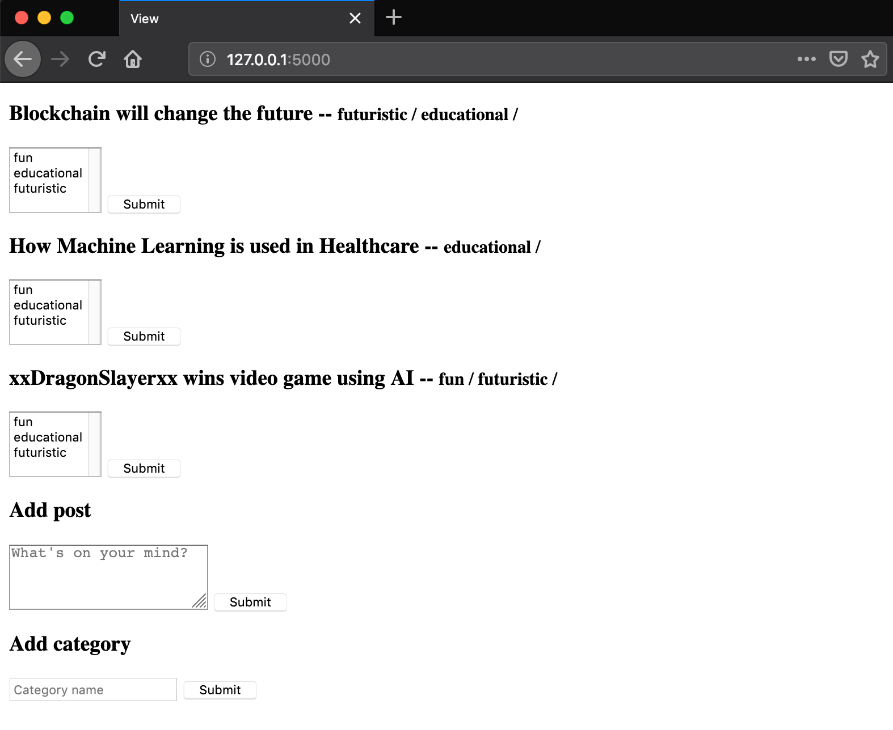

# Lesson 11 - Using Database Relationships with Flask/SQLalchemy - Many to Many

## Learning Objectives
* Create one to many relationships using SQLalchemy

## The Walkthrough
1. Create a Flask Application
	* Name it FlaskApp_09

2. Rename the main python file from FlaskApp_11.py to app.py
	* Make it look like the following
    
```python
from flask import Flask
from flask_sqlalchemy import SQLAlchemy

application = Flask(__name__)
application.config['SQLALCHEMY_DATABASE_URI'] = 'sqlite:///flaskr.db'
db = SQLAlchemy(application)

from routes import app
application.register_blueprint(app)


if __name__=='__main__':
    from app import db
    db.create_all()
    application.run(debug=True)
```
2. Create a file called models.py
	* Make it look like the following

```python
from app import db

tags = db.Table('tags',
    db.Column('category_id', db.Integer, db.ForeignKey('category.id')),
    db.Column('post_id', db.Integer, db.ForeignKey('post.id'))
)

class Post(db.Model):
    id = db.Column(db.Integer, primary_key=True)
    content = db.Column(db.String(140))

    tags = db.relationship('Category', secondary=tags,
                           backref=db.backref('posts', lazy='dynamic'))

    def __init__(self, content):
        self.content = content

    def __repr__(self):
        return '<Post %r>' % self.content


class Category(db.Model):
    id = db.Column(db.Integer, primary_key=True)
    name = db.Column(db.String(50))

    def __init__(self, name):
        self.name = name

    def __repr__(self):
        return '<Category %r>' % self.name
```

2. Create a file called routes.py
	* Make it look like the following
	
```python
from flask import Blueprint, render_template, request, redirect, url_for

app = Blueprint('app', __name__)

from models import Post, Category
from app import db

@app.route('/')
def index():
    posts = Post.query.all()
    categories = Category.query.all()
    return render_template("index.html",
                           posts=posts,
                           categories=categories)


@app.route('/addcategory', methods=['POST', 'GET'])
def addcategory():
    name = request.form['name']
    category = Category(name)
    db.session.add(category)
    db.session.commit()
    return redirect(url_for('app.index'))

@app.route('/addpost', methods=['POST', 'GET'])
def addpost():
    content = request.form['content']
    post = Post(content)
    db.session.add(post)
    db.session.commit()
    return redirect(url_for('app.index'))

@app.route('/addtags', methods=['POST', 'GET'])
def addtags():
    tags = request.form.getlist('tags')
    post_id = request.form['post']
    post = db.session.query(Post).get(post_id)

    for tag in tags:
        category = db.session.query(Category).get(tag)
        post.tags.append(category)
    db.session.commit()
    return redirect(url_for('app.index'))
```

3. Create an index page
	* In the template folder, create an index.html file
	* Make it look like the following
    
    
```html
<!DOCTYPE html>
<html lang="en">
<head>
    <meta charset="UTF-8">
    <title>Title</title>
</head>
<body>


    
        <div >
            <h3>{{ post.content }} --
                <small>
                    
                        {{ tag.name }} /
                    
                </small>
            </h3>


            <form method="POST" action="/addtags" >
                <select multiple name="tags">
                    
                        <option value="{{ category.id }}">{{ category.name }}</option>
                    
                </select>
                <input type="hidden" value="{{ post.id }}" name="post">
                <input type="submit" value="Submit">
            </form>

        </div>
    

    <h3>Add post</h3>
    <form method="POST" action="/addpost" >
        <textarea rows="3"  placeholder="What's on your mind?" name="content"></textarea>
        <input type="submit" value="Submit">
    </form>

    <h3>Add category</h3>
    <form method="POST" action="/addcategory" >
        <input type="text" name="name" placeholder="Category name">
        <input type="submit" value="Submit">
    </form>


</body>
</html>

```

If it is done properly, when you run your application, you will be able to navigate to localhost:5000 and see this:



## What is Going On

This routes creates post and category records using form data. After a post is created, we can then tag it with multiple existing categories. 


### Models

Our model is very similar to that in the One to One relationship. However, we are now using an associate entity (tags) to bridge the two tables. Essentially we are creating a third table **(tags)** which has a one to many relationship with both the Post and Category tables. The associative table's only columns are the **(id)** columns of the two tables it's joining. 

In human speak, each post can tagged with many categories. And each category can have many applicable posts through tags.


## Views
### index.html
Shows a list of all posts in the database. Next to each post, it displays the categories that the post has been tagged with.

We also two forms for creating posts and categories.

## Routes

### @app.route('/')
Return all category and post records in the database

### @app.route('/addcategory')
Creates a category record using form data

### @app.route('/addpost')
Creates a post record using form data

### @app.route('/addtags')
Given a post and a list of tags, it adds each tag to the post's tags. Duplicate tags are not added to a list of a post's tags.
