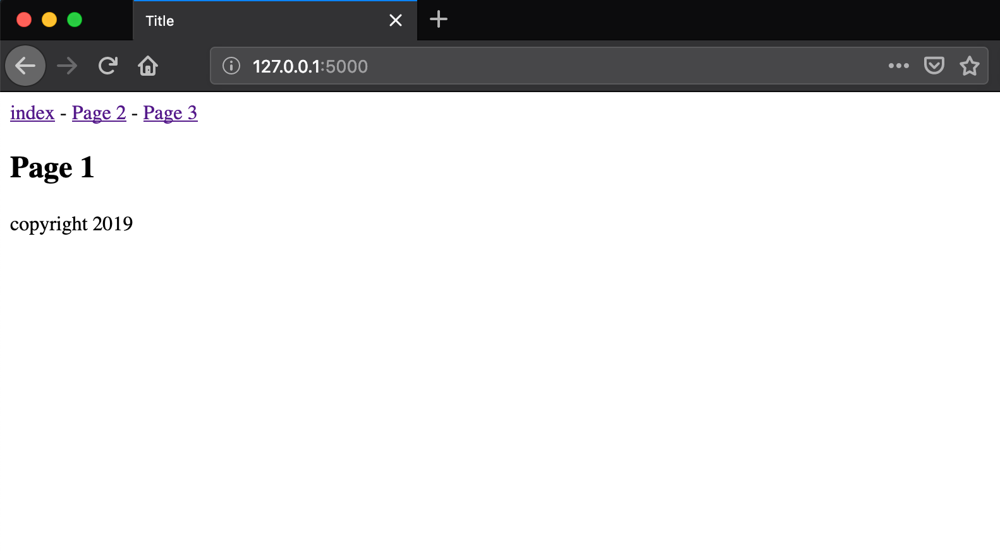
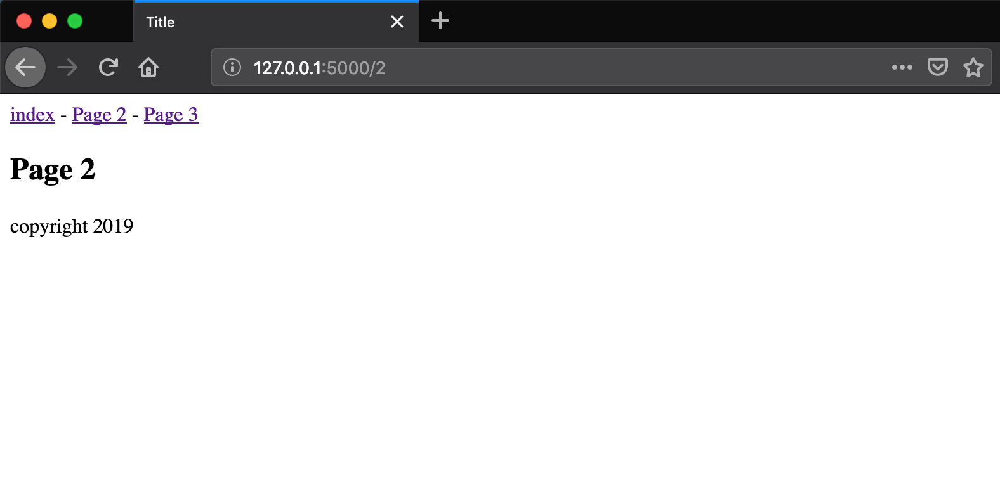
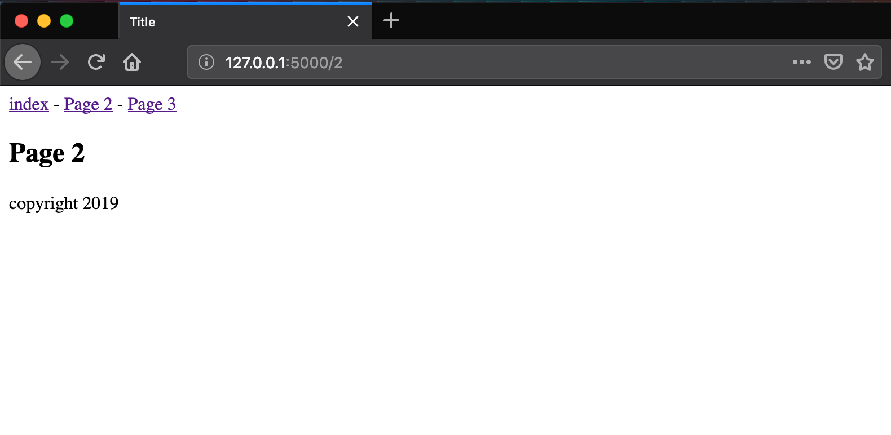

# Lesson 12 - Using Page Fragments with Jinja

## Learning Objectives
* 


## The Walkthrough
1. Create a Flask Application
	* Name it FlaskApp_12

2. Edit the main python file (FlaskApp_12.py)
	* Make it look like the following

```python

from flask import Flask, render_template, flash

app = Flask(__name__)

#We need this for flashing errors
app.secret_key = 'some_secret'

@app.route('/')
def page1():
    return render_template("page1.html")

@app.route('/2')
def page2():
    return render_template("page2.html")

@app.route('/3')
def page3():
    flash("You can alert the user to an error like this.")
    return render_template("page3.html")

if __name__ == '__main__':
    app.run()
```

3. Create an index page
	* In the template folder, create an base.html file
	* Make it look like the following

```html
<!DOCTYPE html>
<html lang="en">
<head>
    <meta charset="UTF-8">
    <title>Title</title>
</head>
<body>
    <div class="navlinks">
        <a href="/">index</a> - <a href="/2">Page 2</a> - <a href="/3">Page 3</a>
    </div>


    
         {{ message }}
    

    

    <div class="footer">copyright 2017</div>
</body>
</html>
```

4. Create a new page
	* In the template folder, create an page1.html file
	* Make it look like the following

```html




    <h2>Page 1</h2>



```

5. Create a new page
	* In the template folder, create an page2.html file
	* Make it look like the following

```html


    
    <h2>Page 2</h2>


```


6. Create a new page
	* In the template folder, create an page3.html file
	* Make it look like the following

```html



    
    <h2>Page 3</h2>


```

If it is done properly, when you run your application, you will be able to navigate to localhost:5000 and see this:







## What is Going On