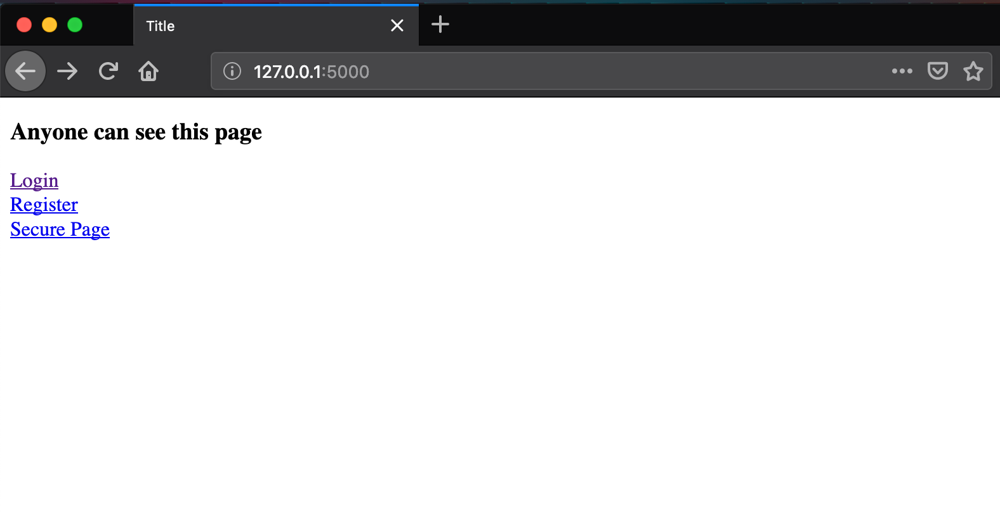
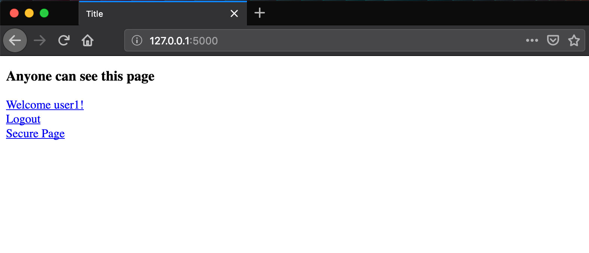
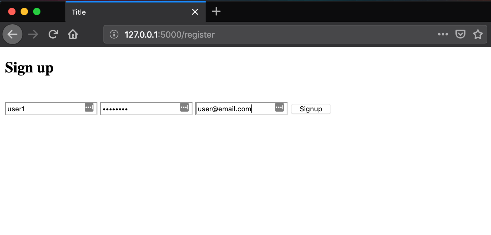
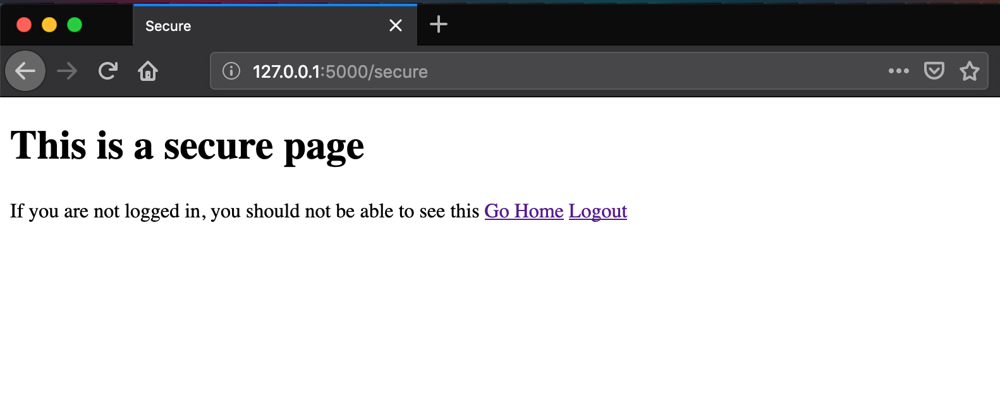

# Lesson 13 - Basic User Authentication

## Learning Objectives
* 

## The Walkthrough
1. Create a Flask Application
	* Name it FlaskApp_13

2. Edit the main python file (FlaskApp_13.py)
	* Make it look like the following
    
```python
import datetime
from flask import Flask, request,render_template, redirect, url_for, g, flash
from flask_sqlalchemy import SQLAlchemy
from flask_login import LoginManager
from flask_login import login_user , logout_user , current_user , \
     login_required

app = Flask(__name__)

app.config['SQLALCHEMY_DATABASE_URI'] = 'sqlite:///flaskr.db'
app.secret_key = 'some_secret'

db = SQLAlchemy(app)

login_manager = LoginManager()
login_manager.init_app(app)
login_manager.login_view = 'login'

@login_manager.user_loader
def load_user(id):
    return User.query.get(int(id))


@app.before_request
def before_request():
    g.user = current_user


@app.route('/')
def index():
    return render_template("index.html")


@app.route('/secure')
@login_required
def secure():
    return render_template("secure.html")


@app.route('/register', methods=['GET', 'POST'])
def register():
    if request.method == 'GET':
        return render_template('register.html')
    user = User(request.form['username'], request.form['password'], request.form['email'])
    db.session.add(user)
    db.session.commit()
    flash('User successfully registered')
    return redirect(url_for('login'))


@app.route('/login', methods=['GET', 'POST'])
def login():
    if request.method == 'GET':
        return render_template('login.html')

    username = request.form['username']
    password = request.form['password']
    remember_me = False
    if 'remember_me' in request.form:
        remember_me = True
    registered_user = User.query.filter_by(username=username, password=password).first()
    if registered_user is None:
        flash('Username or Password is invalid', 'error')
        return redirect(url_for('login'))
    login_user(registered_user, remember=remember_me)
    flash('Logged in successfully')
    return redirect(request.args.get('next') or url_for('index'))

@app.route('/logout')
def logout():
    logout_user()
    return redirect(url_for('index'))

class User(db.Model):
    __tablename__ = "users"
    id = db.Column('user_id', db.Integer, primary_key=True)
    username = db.Column('username', db.String(20), unique=True, index=True)
    password = db.Column('password', db.String(10))
    email = db.Column('email', db.String(50), unique=True, index=True)
    registered_on = db.Column('registered_on', db.DateTime)

    def __init__(self, username, password, email):
        self.username = username
        self.password = password
        self.email = email
        self.registered_on = datetime.datetime.now()

    def is_authenticated(self):
        return True

    def is_active(self):
        return True

    def is_anonymous(self):
        return False

    def get_id(self):
        return unicode(self.id)

    def __repr__(self):
        return '<User %r>' % (self.username)


if __name__ == '__main__':
    db.create_all()
    app.run()
```


3. Create an index page
	* In the template folder, create an base.html file
	* Make it look like the following
    
```html
<!DOCTYPE html>
<html lang="en">
<head>
    <meta charset="UTF-8">
    <title>Title</title>
</head>
<body>
    <h3>Anyone can see this page</h3>

    
        <li><a href="#">Welcome {{ g.user.username }}!</a></li>
        <li><a href="{{ url_for('logout') }}">Logout</a></li>
        <li><a href="{{ url_for('secure') }}">Secure Page</a></li>
    
        <li><a href="{{ url_for('login') }}">Login</a></li>
        <li><a href="{{ url_for('register') }}">Register</a></li>
        <li><a href="{{ url_for('secure') }}">Secure Page</a></li>
    
</body>
</html>
```


4. Create a new page
	* In the template folder, create an login.html file
	* Make it look like the following

```html
<!DOCTYPE html>
<html lang="en">
<head>
    <meta charset="UTF-8">
    <title>Title</title>
</head>
<body>
<form action="" method=post class="form-horizontal">
    <h2>Sign in to FlaskLogin(Todo) Application </h2>

    <input type="text" id="username" name="username"
           placeholder="Enter Username" required>

    <input type="password" id="password" name="password"
           placeholder="Enter Password" required>

    <button type="submit" >Signin</button>

</form>
</body>
</html>
```

5. Create a new page
	* In the template folder, create an register.html file
	* Make it look like the following

```html
<!DOCTYPE html>
<html lang="en">
<head>
    <meta charset="UTF-8">
    <title>Title</title>
</head>
<body>
<form action="" method=post class="form-horizontal">
    <h2>Sign up </h2>
    <br>
    <input type="text" id="username" name="username" class="form-control"
           placeholder="Enter Username" value="{{ request.form.username }}"
           required>

    <input type="password" id="password" name="password" class="form-control"
           placeholder="Enter Password" value="{{ request.form.password }}"
           required>


    <input type="email" id="email" name="email" class="form-control"
           placeholder="Enter Email" value="{{ request.form.username }}"
           required>

    <button type="submit" class="btn btn-success btn-block">Signup</button>

</form>

</body>
</html>
```


5. Create a new page
	* In the template folder, create an secure.html file
	* Make it look like the following
    
```html
<!DOCTYPE html>
<html lang="en">
<head>
    <meta charset="UTF-8">
    <title>Title</title>
</head>
<body>
    <h1>This is a secure page</h1>
</body>
</html>
```

If it is done properly, when you run your application, you will be able to navigate to localhost:5000 and see this:



To login to the application, you must first register an account by going to localhost:5000/register.



You can login by going to localhost:5000/login.



You should only be able to view the secure page when you are logged in:


