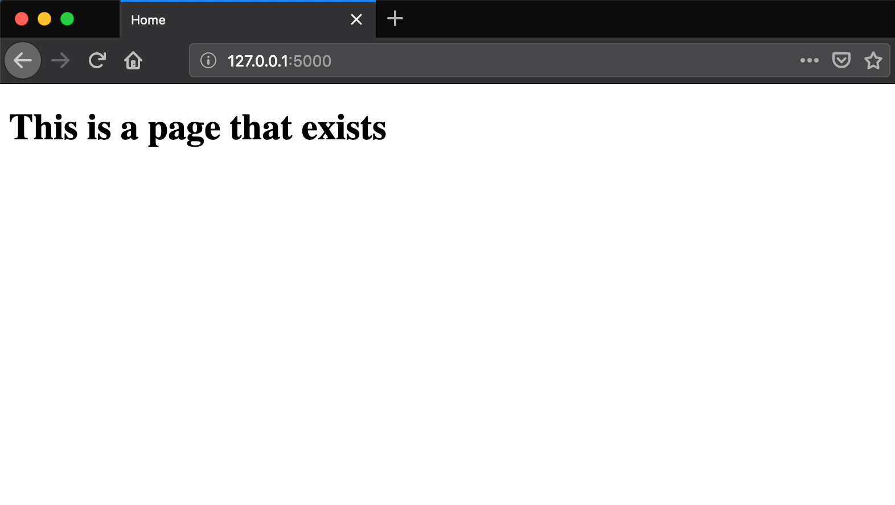

# Lesson 14 - Custom Error Pages

## Learning Objectives
* 

## The Walkthrough
1. Create a Flask Application
	* Name it FlaskApp_14

2. Edit the main python file (FlaskApp_14.py)
	* Make it look like the following
    
```python
from flask import Flask, render_template

app = Flask(__name__)


@app.errorhandler(404)
def page_not_found(e):
    return render_template('404.html'), 404

@app.route('/')
def index():
    return render_template("index.html")

if __name__ == '__main__':
    app.run()
```

3. Create an index page
	* In the template folder, create an index.html file
	* Make it look like the following
    
```html
<!DOCTYPE html>
<html lang="en">
<head>
    <meta charset="UTF-8">
    <title>Title</title>
</head>
<body>
<h1>This is a page that exists</h1>
</body>
</html>
```

3. Create the custom error page
	* In the template folder, create an 404.html file
	* Make it look like the following
    
```
<!DOCTYPE html>
<html lang="en">
<head>
    <meta charset="UTF-8">
    <title>Title</title>
</head>
<body>
    <h1>Page not found</h1>
    <h3>Why don't you try some covfefe instead?</h3>
    <p><a href="{{ url_for('index') }}">go somewhere nice</a>
</body>
</html>
```


If it is done properly, when you run your application, you will be able to navigate to localhost:5000 and see this:


If you visit a page that does not exist (e.g. localhost:5000/youcantfindme) you should see this:



